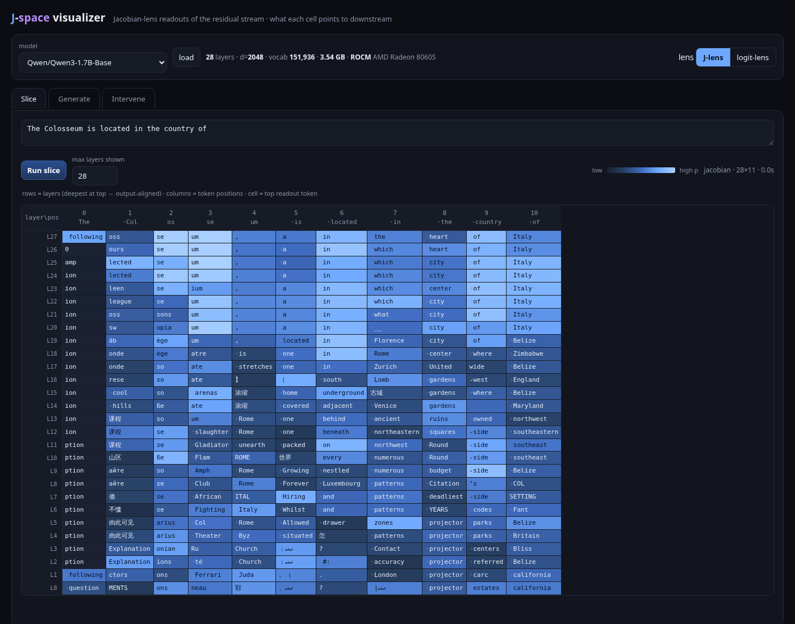

# J-space visualizer

A **Jacobian-lens ("J-lens") visualizer** for local language models on an NVIDIA
GPU. It shows a **position × layer grid** where each cell is the token that an
intermediate activation most points the model toward *downstream*, and it
streams a live **workspace band** as the model generates — so you can watch a
concept form in the residual stream *before* (or instead of) it reaches the
visible output.

This is a PyTorch/CUDA port of the idea in
[WeZZard/jlens-qwen36](https://github.com/WeZZard/jlens-qwen36) (Qwen3.6-27B on
Apple MLX), which was in turn inspired by Anthropic's
["Verbalizable Representations Form a Global Workspace in Language Models"](https://transformer-circuits.pub/2026/workspace/).
It is a demo/exploration tool, not a research-grade reproduction.


## What it computes

For each residual-stream cell `h_l[t]` (layer `l`, position `t`):

**Logit lens** (the classic baseline):

```
readout(t, l) = softmax( W_U · norm( h_l[t] ) )
```

**Jacobian lens** — projects the activation through the network's own
sensitivity to the final layer first:

```
readout(t, l) = softmax( W_U · norm( J_l · h_l[t] ) )
J_l = d(final_resid) / d(h_l)        (future-summed:  Σ_{t' ≥ t} d final_resid[t'] / d h_l[t])
```

`J_l · h_l[t]` answers *"if this internal vector were nudged, which tokens would
it push the model toward saying downstream?"* — which is what makes middle-layer
"workspace" readouts legible where the raw logit lens is noise.

Unlike the reference (which fits a **corpus-averaged** `J_l` offline), this port
computes a **context-specific** Jacobian, exact for the current prompt, so there
is **no fitting/caching step**. The Jacobian-vector product is formed with the
forward-over-reverse trick (two backward passes), which needs no forward-mode AD:

```
g(u) = d⟨final_resid, u⟩ / d h_l = Jᵀu     # 1st backward, create_graph=True
J·v  = d⟨g, v⟩ / du                        # 2nd backward
```

Because double-backward isn't supported by fused/flash attention, the model is
loaded with `attn_implementation="eager"`.

## Features

- **Slice** — full position × layer grid for a static prompt (J-lens or logit-lens),
  probability heatmap, click any cell to pin its readout.
- **Generate** — greedy/temperature streaming; every generated token adds a
  column, and the per-layer readout at the generating position is the *workspace
  band*, so you watch concepts appear in middle layers ahead of emission.
- **Intervene** — add a steering vector `v = ∂ logit(token) / ∂ h_layer` into the
  residual stream at a chosen layer and compare baseline vs. steered generation.

## Requirements

An NVIDIA GPU, an AMD GPU (ROCm), or CPU. The backend is auto-detected — ROCm
masquerades as `torch.cuda`, so the same code path drives both vendors. The
default 1.7B model needs < 4 GB. The Python env is created with `uv`.

Tested on:

| box | backend | device | torch |
|---|---|---|---|
| RTX 3090 (24 GB) | CUDA 12.4 | NVIDIA GeForce RTX 3090 | 2.6.0+cu124 |
| Strix Halo (Ryzen AI Max+ 395) | ROCm 7.2 | AMD Radeon 8060S, gfx1151 | 2.13.0+rocm7.2 |

## Run

```bash
./run.sh                # -> http://127.0.0.1:8765   (default port 8765)
./run.sh 9000           # custom port
HOST=0.0.0.0 ./run.sh   # listen on all interfaces (LAN-visible)
```

Then open the URL. Pick a model, hit **Run slice** or **Stream generation**.
The model dropdown lists text causal-LMs found in `~/.cache/huggingface/hub`.

Deep links / auto-run are supported, e.g.:

```
http://127.0.0.1:8765/?tab=slice&lens=jacobian&run=slice&prompt=The%20Colosseum%20is%20in%20the%20country%20of
```

## Models

Auto-discovered from the local HF cache. Good defaults (standard, fully
differentiable dense transformers):

- `Qwen/Qwen3-1.7B-Base` (default, 28 layers)
- `Qwen/Qwen3-0.6B-Base` (fastest)
- other cached `*ForCausalLM` checkpoints

`Qwen/Qwen3.5-2B-Base` (the Gated-DeltaNet linear-attention hybrid, closest to
the reference's architecture) is listed too; the J-lens path may be slower or
fall back on its custom-kernel layers — logit-lens always works.

## Layout

```
jspace/
  model.py   # HF loader; forward pass that keeps per-layer residuals in the autograd graph
  lens.py    # logit-lens + J-lens (JVP readout), workspace band, streaming, steering
  serve.py   # FastAPI: /api/{models,load,slice,generate(SSE),intervene}
web/
  index.html # single-file dark UI: grid, streaming band, interventions
scripts/
  smoke_test.py   # validates the mechanism (residual capture, readouts, invariants)
run.sh
```

## Running on AMD (ROCm / Strix Halo)

Everything works, including the double-backward JVP the J-lens depends on
(`scripts/rocm_probe.py` checks it against finite differences: rel err ~1.7e-4,
matching CUDA's ~1.9e-4). Setup:

```bash
uv venv --python 3.13 .venv
source .venv/bin/activate
uv pip install -r requirements-rocm.txt     # match the index to your ROCm version
python scripts/rocm_probe.py                # verify bf16, eager attn, double-backward
```



Two Strix Halo specifics:

**1. Expose unified memory to the GPU.** The BIOS VRAM carveout is often only
2 GB; the rest of system RAM reaches the GPU via GTT. With these kernel params
torch reports the full 126.7 GB rather than 2 GB:

```
amdgpu.gttsize=114688 ttm.pages_limit=30932992 ttm.page_pool_size=30932992
```

**2. Never copy weights straight from the mmap'd safetensors file.**
`from_pretrained` returns parameters aliasing the mmap. A host→device copy from
those file-backed pages runs at **0.021 GB/s** on ROCm, versus **15.5 GB/s** once
the tensor is cloned into ordinary memory — loading a 1.7B model took **388 s**.
Neither `low_cpu_mem_usage=False` nor `device_map="cuda"` avoids it (both still
copy per-tensor from the mmap). `model.move_to_device_fast()` clones each tensor
into anonymous RAM first, memoizing on parameter identity so tied weights stay
tied: **388 s → 0.5 s**.

Rough timings (Qwen3-1.7B-Base, `"The capital of France is"`, 28 layers × 5 pos):

| | model load | logit-lens grid | J-lens grid |
|---|---|---|---|
| RTX 3090 (CUDA) | 3.7 s | 0.09 s | 2.05 s |
| Radeon 8060S (ROCm) | 0.5 s | 0.25 s | 1.75 s |

High-confidence readouts are identical across the two backends. Low-probability
cells occasionally differ (near-ties flipping under different bf16 kernels and
reduction orders), and greedy generation can diverge a few tokens in for the
same reason.

## Memory & reproducibility

A J-lens slice runs one batched forward (one sequence per position) and keeps
its graph alive across all layers, so peak memory above the resident weights is

```
peak_GB(B, T) ~= 0.0067*B*T + 5.5e-6*B*T^2
```

(linear term = activations, quadratic = eager attention scores retained for
backward). `Lens.auto_pos_chunk()` solves this for the largest position-batch
that fits `MEM_UTILIZATION` of VRAM, with an OOM-backoff that halves the chunk
and retries. Before this, a fixed chunk of 24 OOM'd a 24 GB card at ~108 tokens;
now a 432-token prompt peaks at 15.8 GB. There is **no leak** — memory returns
to the resident 3.46 GB after every request (`scripts/mem_test.py` checks all of
this).

Long prompts get slow, not fatal: the chunk shrinks, so wall time grows roughly
as `T^2` (432 tokens ≈ 10 min for a full 28-layer grid). Cut `max_layers`, or
use the logit lens, which needs no graph at all.

**Reproducibility.** bf16 matmuls are batch-size dependent (split-k reduction
order), so changing `pos_chunk` perturbs readout logits by ~1e-2 relative
(cosine similarity 0.9995). That flips the argmax *only* where the top-2 are
near-tied: 9% of cells, median p=0.09, and **no cell with p>0.40 ever
disagrees**. `auto_pos_chunk` therefore depends only on (device, model, T) — not
on live allocation — so a given prompt always renders the same grid. Pass
`pos_chunk` explicitly to `/api/slice` to pin it across machines. The same
effect makes low-confidence cells differ between CUDA and ROCm.

## Notes & limitations

- The bottom J-lens row (deepest layer, where `J = I`) equals the model's actual
  next-token prediction — a built-in sanity check.
- Base models emit junk filler tokens (`____`) as low-confidence readouts; that's
  the model, not the lens.
- A short slice is a few seconds; the live band is ~1–2 s/token (one Jacobian per
  layer). Switch to **logit-lens** for instant readouts.
- Interventions are subtle on small models with a single-context steering vector.

Credit: concept & UI inspiration from
[WeZZard/jlens-qwen36](https://github.com/WeZZard/jlens-qwen36) and Anthropic's
global-workspace work.
