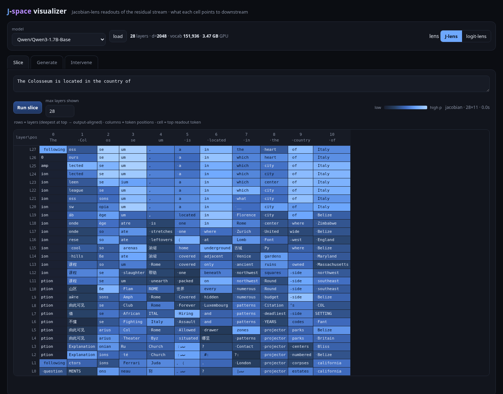

# J-space visualizer

A **Jacobian-lens ("J-lens") visualizer** for local language models on an NVIDIA
GPU. It shows a **position × layer grid** where each cell is the token that an
intermediate activation most points the model toward *downstream*, and it
streams a live **workspace band** as the model generates — so you can watch a
concept form in the residual stream *before* (or instead of) it reaches the
visible output.

This is a PyTorch/CUDA port of the idea in
[WeZZard/jlens-qwen36](https://github.com/WeZZard/jlens-qwen36) (Qwen3.6-27B on
Apple MLX), which was in turn inspired by Anthropic's
["Verbalizable Representations Form a Global Workspace in Language Models"](https://transformer-circuits.pub/2026/workspace/).
It is a demo/exploration tool, not a research-grade reproduction.



## What it computes

For each residual-stream cell `h_l[t]` (layer `l`, position `t`):

**Logit lens** (the classic baseline):

```
readout(t, l) = softmax( W_U · norm( h_l[t] ) )
```

**Jacobian lens** — projects the activation through the network's own
sensitivity to the final layer first:

```
readout(t, l) = softmax( W_U · norm( J_l · h_l[t] ) )
J_l = d(final_resid) / d(h_l)        (future-summed:  Σ_{t' ≥ t} d final_resid[t'] / d h_l[t])
```

`J_l · h_l[t]` answers *"if this internal vector were nudged, which tokens would
it push the model toward saying downstream?"* — which is what makes middle-layer
"workspace" readouts legible where the raw logit lens is noise.

Unlike the reference (which fits a **corpus-averaged** `J_l` offline), this port
computes a **context-specific** Jacobian, exact for the current prompt, so there
is **no fitting/caching step**. The Jacobian-vector product is formed with the
forward-over-reverse trick (two backward passes), which needs no forward-mode AD:

```
g(u) = d⟨final_resid, u⟩ / d h_l = Jᵀu     # 1st backward, create_graph=True
J·v  = d⟨g, v⟩ / du                        # 2nd backward
```

Because double-backward isn't supported by fused/flash attention, the model is
loaded with `attn_implementation="eager"`.

## Features

- **Slice** — full position × layer grid for a static prompt (J-lens or logit-lens),
  probability heatmap, click any cell to pin its readout.
- **Generate** — greedy/temperature streaming; every generated token adds a
  column, and the per-layer readout at the generating position is the *workspace
  band*, so you watch concepts appear in middle layers ahead of emission.
- **Intervene** — add a steering vector `v = ∂ logit(token) / ∂ h_layer` into the
  residual stream at a chosen layer and compare baseline vs. steered generation.

## Requirements

- NVIDIA GPU (built/tested on an RTX 3090, 24 GB; the default 1.7B model uses < 4 GB).
- The Python env is created with `uv` (already used for setup).

## Run

```bash
./run.sh              # -> http://127.0.0.1:8765   (default port 8765)
./run.sh 9000         # custom port
```

Then open the URL. Pick a model, hit **Run slice** or **Stream generation**.
The model dropdown lists text causal-LMs found in `~/.cache/huggingface/hub`.

Deep links / auto-run are supported, e.g.:

```
http://127.0.0.1:8765/?tab=slice&lens=jacobian&run=slice&prompt=The%20Colosseum%20is%20in%20the%20country%20of
```

## Models

Auto-discovered from the local HF cache. Good defaults (standard, fully
differentiable dense transformers):

- `Qwen/Qwen3-1.7B-Base` (default, 28 layers)
- `Qwen/Qwen3-0.6B-Base` (fastest)
- other cached `*ForCausalLM` checkpoints

`Qwen/Qwen3.5-2B-Base` (the Gated-DeltaNet linear-attention hybrid, closest to
the reference's architecture) is listed too; the J-lens path may be slower or
fall back on its custom-kernel layers — logit-lens always works.

## Layout

```
jspace/
  model.py   # HF loader; forward pass that keeps per-layer residuals in the autograd graph
  lens.py    # logit-lens + J-lens (JVP readout), workspace band, streaming, steering
  serve.py   # FastAPI: /api/{models,load,slice,generate(SSE),intervene}
web/
  index.html # single-file dark UI: grid, streaming band, interventions
scripts/
  smoke_test.py   # validates the mechanism (residual capture, readouts, invariants)
run.sh
```

## Notes & limitations

- The bottom J-lens row (deepest layer, where `J = I`) equals the model's actual
  next-token prediction — a built-in sanity check.
- Base models emit junk filler tokens (`____`) as low-confidence readouts; that's
  the model, not the lens.
- A slice is a few seconds; the live band is ~1–2 s/token (one Jacobian per layer).
  Switch to **logit-lens** for instant readouts.
- Interventions are subtle on small models with a single-context steering vector.

Credit: concept & UI inspiration from
[WeZZard/jlens-qwen36](https://github.com/WeZZard/jlens-qwen36) and Anthropic's
global-workspace work.
